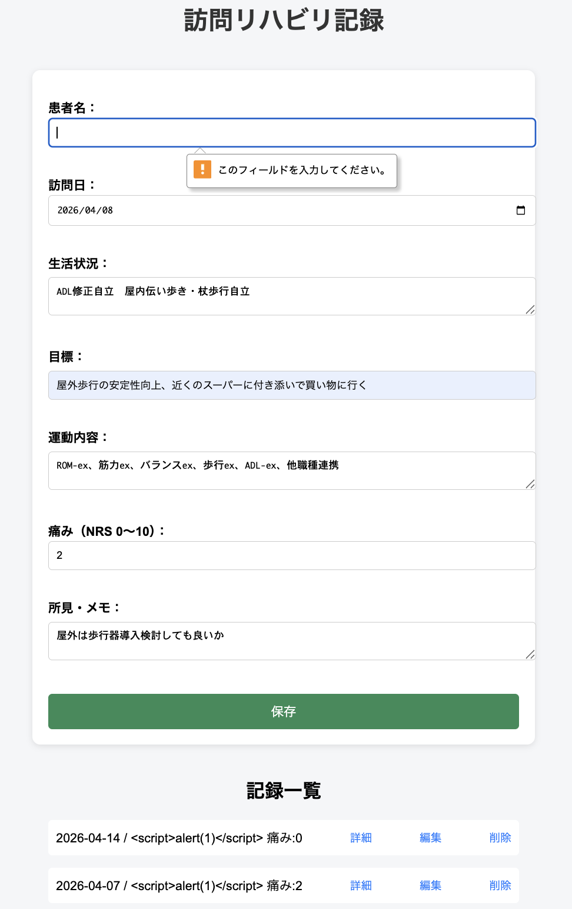
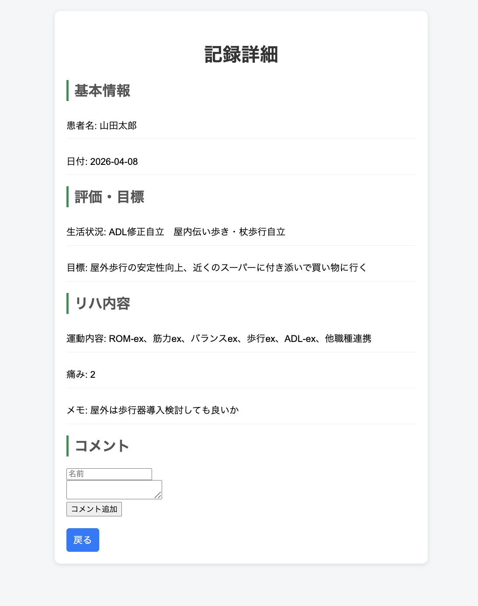
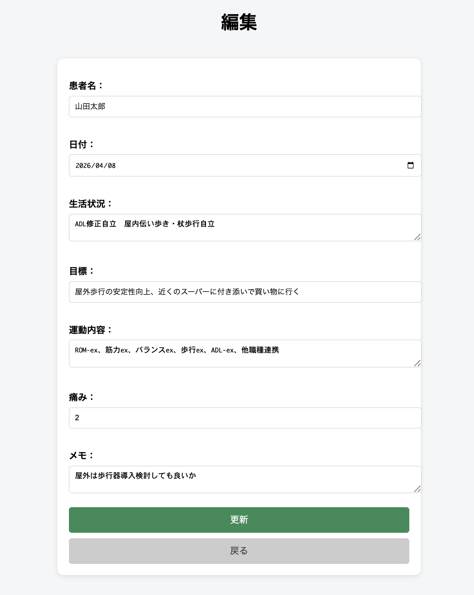

# 訪問リハビリ記録アプリ

訪問リハビリの記録を管理するためのWebアプリです。
患者ごとのリハビリ内容・目標・痛みなどを記録・閲覧・編集できます。

現場での記録業務を想定し、シンプルで直感的に操作できるUIを意識して開発しました。

CRUD機能を中心に、実務を意識した設計で開発しました。

---

## 🖥️ デモ画面

### ■ 入力・一覧画面


### ■ 詳細画面


### ■ 編集画面


---

## ✨ 機能一覧

- 記録の新規登録
- 記録一覧表示
- 記録詳細表示
- 記録編集機能
- 記録削除機能
- バリデーション（必須入力チェック）
- XSS対策（エスケープ処理）
- コメント機能（他職種連携）
- コメント投稿者表示

---

## 🔐 セキュリティ対策

ユーザー入力値は `htmlspecialchars` を用いてエスケープ処理を行い、XSS（クロスサイトスクリプティング）対策を実装しています。
不正なスクリプトが実行されないことを確認済みです。

```php
htmlspecialchars($row["patient"], ENT_QUOTES, 'UTF-8');
```
---

## 🛠 使用技術

## 🧠 技術選定の理由

- PHP：フレームワークを使用せずにCRUD処理を自作することで、リクエスト〜レスポンスの流れやサーバーサイド処理の基本を理解するために採用

- MySQL：リハビリ記録という構造化データを適切に管理するため、リレーショナルデータベースを採用し、テーブル設計や正規化の理解を深めるために使用

- Docker：開発環境の差異による不具合を防ぎ、誰でも同じ環境でアプリを再現できるようにするために採用

- HTML / CSS：医療現場での使用を想定し、直感的でシンプルなUIを実現するために使用


---

## 💡 工夫した点

- 医療現場での使用を想定し、入力や確認の手間を減らすためにシンプルで直感的なUI設計を意識しました。
特に、必要な情報にすぐアクセスできるよう画面構成を整理し、操作に迷わない導線設計を行いました。

- 一覧画面から詳細・編集・削除へスムーズに遷移できるようにし、実際の業務フローに近い操作感になるよう設計しました。
これにより、記録の確認や修正を効率的に行えるよう工夫しています。

- ユーザー入力値はエスケープ処理を行い、XSS対策を実装しました。  
単に機能を作るだけでなく、実務を意識してセキュリティ面にも配慮しています。

---
## 🗄️ データベース構成

```sql
CREATE TABLE records (
  id INT AUTO_INCREMENT PRIMARY KEY,
  patient VARCHAR(255),
  date DATE,
  life TEXT,
  goal TEXT,
  exercise TEXT,
  pain INT,
  memo TEXT
);
```
---

## 🚀 起動方法

### ① Docker起動

```bash
docker-compose up -d
```
### ② ブラウザでアクセス
http://localhost:8080

※Docker起動後に上記URLへアクセスしてください

---

## 🎯 今後の課題

- ユーザー認証機能の実装（ログイン・権限管理）
- データの永続化およびバックアップ対応
- UI/UXの改善（モバイル対応・操作性向上）

---